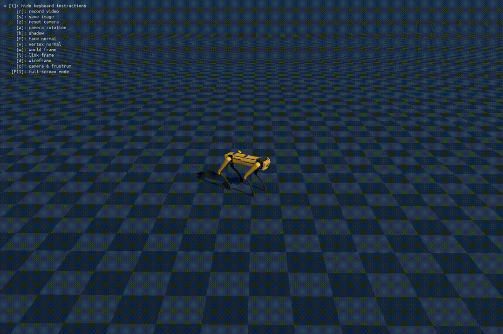

# Teaching Spot to walk: A quadruped locomotion task

## Motivation
I took my first robotics class in the Spring of 2025 taught at Stanford titled "CS224R: Deep Reinforcement Learning". However, at the end of the course, I felt the need for more exploratory projects to develop better muscle for reinforcement learning techniques and robotics.

For context, I build web applications as a Software Engineer. While I had some familiarity with ML/Data Science frameworks like numpy and pandas, designing policies for sophisticated robotic tasks required some familiarity with Differential geometry, specifically Configuration spaces and Rigid body motions. I found Northwestern University's Modern Robotics Specialization ^[[Modern Robotics: Mechanics, Planning, and Control Specialization](https://www.coursera.org/specializations/modernrobotics)] on coursera to be instrumental.

Then it was time to build! Instead of building from scratch, I picked a reinforcement learning task (Quadruped locomotion) and searched for a relevant open-source project, leading me to Federrico's guide ^[[Making quadrupeds Learning to walk: Step-by-Step Guide](https://federicosarrocco.com/blog/Making-Quadrupeds-Learning-To-Walk)]. I focused on the following:

* Studying the Genesis Physics Simulation API, and using the latest version for my experiments.
* Replacing the Go robot with Spot (without the end-effector), and selecting a suitable set of joint angles allowing the robot to achieve a stable standing pose. This is crucial for training, especially when environments need to be reset.
* Extending the training loop to learn control beyond x-y linear and z-angular rotation commands (allowing the robot to move forwards, backwards and yaw on either side) to include a "crouch" toggle command so that Spot plays fetch :)

Teleoperation demo recorded at 4x speed

## Observations
Extending the set of commands significantly increases the difficulty of the learning task. After including the crouch command, I observed a decrease in policy quality: jittery motion even for zero-valued command inputs. Attemping an improvised fine-tuning strategy helped reduce jitter, but also impacted the policy's ability to properly respond to certain commmands (like the yaw command)